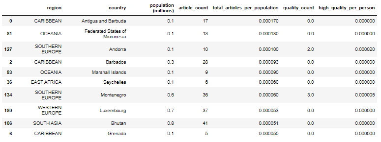
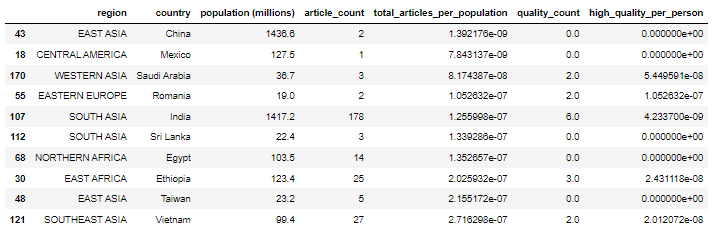
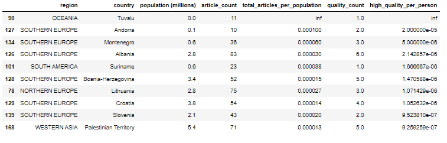
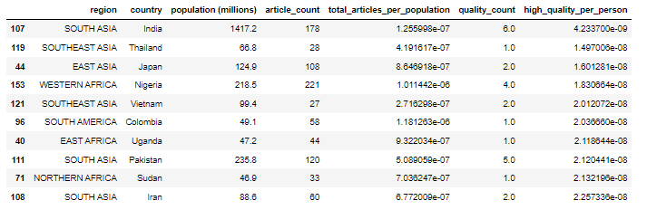
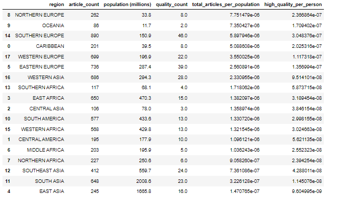
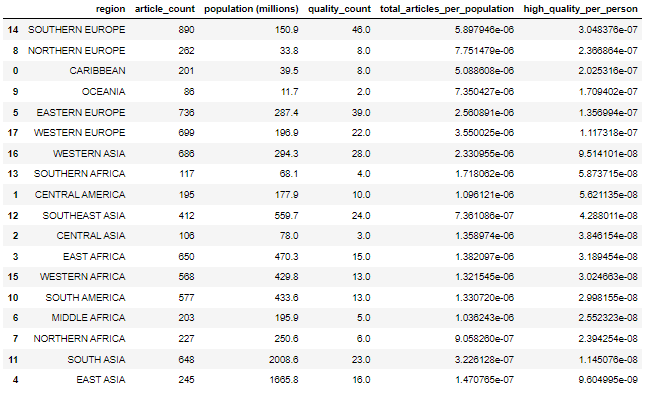

# Human Centered Data Science - A2: Considering Bias in Data

This repository contains the code and resulting data which tries to explore the concept of bias in data using Wikipedia articles. It was originally completed for the second assignment of the University of Washington's Human Centered Data Science (DATA 512) course in Autumn 2022.
The goal of this assignment is to explore the concept of bias in data using Wikipedia articles. This assignment will consider articles on political figures from different countries. For this assignment, I combined datasets of Wikipedia articles with a dataset of country populations, and used a machine learning service called ORES to estimate the quality of each article.
I then performed an analysis of how the coverage of politicians on Wikipedia and the quality of articles about politicians varies among countries. 
My analysis consists of a series of tables that show:
The countries with the greatest and least coverage of politicians on Wikipedia compared to their population.
The countries with the highest and lowest proportion of high quality articles about politicians.
A ranking of geographic regions by articles-per-person and proportion of high quality articles.
Finally I wrote short reflection on the project that focuses on how both findings from this analysis and the process I went through to reach those findings helps me understand the causes and consequences of biased data in large, complex data science projects.


## Data Sources Used

To create these tables, we will draw from two data sources:
  1. [politicians_by_country.SEPT.2022.csv](https://docs.google.com/spreadsheets/d/1Y4vSTYENgNE5KltqKZqnRQQBQZN5c8uKbSM4QTt8QGg/edit#gid=1672307727)  
  2. [population_by_country_2022.csv](https://docs.google.com/spreadsheets/d/1POuZDfA1sRooBq9e1RNukxyzHZZ-nQ2r6H5NcXhsMPU/edit#gid=1154770218) 


## Data Descriptions/Schemas

### The Wikipedia Dataset

| Column | Description |
|--------|-------------|
| name | name of the politician |
| url | wikipedia url to article about the politican |
| country | country where politician comes from |


### The Population Dataset cleaned into 4 columns

| Column | Description |
|--------|-------------|
| Continent | The name of the continent where the country can be found |
| Region | Represents geographic region of the country |
| Country | Name of the country |
| Population (millions) | Population of the geographical region in millions, as of 2022 |


#### Output File

This is the final file used for analysis

| Column | Description |
|--------|-------------|
| country | Country name |
| region | geographic region of country|
| population | The population of this country, as of 2022 |
| article_title | Article titles for politicians within a country|
| revision_id | Article revision Ids for ORES label predictions |
| article_quality | article qualities predicted by ORES |

## Resources Used

### Versions and Documentation
 * This analysis was prepared using Python 3.7 running in a Jupyter Notebook environment.  
 * Documentation for Python can be found [here](https://docs.python.org/3.5/)   
 * Documentation for Jupyter Notebook can be found [here](http://jupyter-notebook.readthedocs.io/en/latest/)   


### Article Revision_ID
I used the [API:Info](https://www.mediawiki.org/wiki/API:Info) request to get a range of metadata on each article, including the most current revision ID of the article page.


### ORES
For predicting article quality, the [ORES API](https://www.mediawiki.org/wiki/ORES) was used. The prediction returned by ORES is in the form of probabilities, as well as an absolute prediction. An article may be predicted to have one of the following quality levels:
 * **FA** - Featured article
 * **GA** - Good article
 * **B** - B-class article
 * **C** - C-class article
 * **Start** - Start-class article
 * **Stub** - Stub-class article

We define "high-quality" as an article predicted to be either **FA** or **GA**.

A sample response from ORES looks like this:
```json
{
  "enwiki": {
    "models": {
      "wp10": {
        "version": "0.5.0"
      }
    },
    "scores": {
      "757539710": {
        "wp10": {
          "score": {
            "prediction": "Start",
            "probability": {
              "B": 0.0950995993086368,
              "C": 0.1709859524092081,
              "FA": 0.002534267983331672,
              "GA": 0.005731369423122624,
              "Start": 0.7091352495053856,
              "Stub": 0.01651356137031511
            }
          }
        }
      },
      "783381498": {
        "wp10": {
          "score": {
            "prediction": "Start",
            "probability": {
              "B": 0.020202281665235494,
              "C": 0.040498863202895134,
              "FA": 0.002648428776337411,
              "GA": 0.005101906528059532,
              "Start": 0.4793812253273645,
              "Stub": 0.452167294500108
            }
          }
        }
      }
    }
  }
}
```

### Python Packages
The following Python packages were used and their documentation can be found at the accompanying links:
 * [pandas](https://pandas.pydata.org/pandas-docs/stable/api.html): Python Data Analysis Library
 * [tqdm](https://github.com/tqdm/tqdm): Fast and Extensible Progress Bar
 * [requests](http://docs.python-requests.org/en/master/): HTTP for Humans
 * [matplotlib](https://matplotlib.org/3.5.1/api/_as_gen/matplotlib.pyplot.html): For plotting graphs
 * [seaborn](https://seaborn.pydata.org/): for data visualization based on matplotlib.

## Files Created

1. [`article_quality.json`](data/output/article_quality.json) contains the predicted quality of each article.
2. [`article_revisions.json`](data/output/article_revisions.json) contains each article and revision_id.
3. [`wp_countries-no_match.txt`](data/output/wp_countries-no_match.txt) contains all countries for which there are no matches.
4. [`wp_politicians_by_country.csv`](data/output/wp_politicians_by_country.csv) contains the final data used for analysis


## Directory Structure

```

.
├── data
│   ├── cleaned
│   │   └── population_by_country_2022_cleaned.csv
│   ├── output
│   │   ├── article_quality.json
│   │   ├── article_revisions.json
│   │   ├── wp_countries-no_match.txt
│   │   └── wp_politicians_by_country.csv
│   └── raw
│       ├── politicians_by_country_SEPT.2022.csv
│       └── population_by_country_2022.csv
├── results
│   ├── buttom_10_countries_by_coverage.png
│   ├── buttom_10_countries_by_quality.png
│   ├── geographic_regions_by_high_quality_coverage.png
│   ├── geographic_regions_by_total_coverage.png
│   ├── top_10_countries_by_coverage.png
│   └── top_10_countries_by_quality.json
├── src
│   └── hcds-a2-considering-bais-in-data.ipynb
├── README.md
└── LICENSE
```

## Results
Top 10 countries by coverage


Buttom 10 countries by coverage


Top 10 countries by quality


Buttom 10 countries by quality


Geographic regions by total coverage


Geographic regions by high quality coverage


## Reproducibility

In order to reproduce the results in this notebook, follow the following steps:

1. Clone this repository:
```
git clone https://github.com/halculvin/data-512-homework_2.git
```
2. Install external libraries using pip (or conda)
```
pip3 install pandas requests tqdm
```
3. Start the Jupyter notebook:
 jupyter notebook
```
4. To observe the exact same results as this notebook, simply rerun it in Jupyter. 
```


## License

This code is available under the [MIT License](LICENSE)

Wikimedia [Terms of Use](https://foundation.wikimedia.org/wiki/Terms_of_Use/en)


## Research Implications

### What I Learned

- Documentation and Reproducibility Are Hard<br/>
I often find myself complaining about how most open-source projects that I use (or try to) have scarce levels of documentation, and that they are hardly understandable, let alone reproducible. I now realize how hard it is to provide just enough information for someone else to have all the context that I have in order to replicate my work. When I put on my "new person to this repo" hat, I find my own work rife with holes and gaps. It is commendable that projects that are more complex by several orders of magnitude are adopted so heavily, and that the community drives the quality of the repository.

- Accuracy is not the End Goal<br/>
For the short period of four years that I have been dabbling in machine learning, I have always considered a numeric metric to be the goal; 99% is _always_ better than 95%. This assignment has taught me that critically analyzing the algorithm at hand, investigating the sources of bias, and providing context to the results are equally, if not more, important. I relate back to the phrase "the numbers speak for themselves", and think to myself "Well I can change that."

- What I Suspected (and Validated)

1. An obvious but important thing to note is that the source of these data is from the *English* Wikipedia pages. One might already suspect a bias in article quality due to this; articles about local politicians might be far richer in pages in their native language, than in English. Alternatively, if certain languages are not supported by Wikipedia, then pages relating to those countries, regardless of category, can be expected to be poorer in quality.
2. With the metric that we are trying to measure, the population might be a stronger factor than the number of articles for that country. The number of articles vary from 1 to a few thousand (max-min ratio of 10<sup>3</sup>), whereas the population varies from 10<sup>4</sup> to 10<sup>9</sup> (max-min ratio of 10<sup>5</sup>). This, in my opinion, is a biased metric to measure; a country with twice the population does not necessarily have twice the number of politicians, let alone pages about them.

### What I Found

1. As suspected, the highest ranked countries for the total number of articles per population overlap strongly with the least populated countries (8 out of 10 in the former are in the latter).
2. From the ORES Wiki:
 > The wp10 model bases its predictions on __structural characteristics__ of the article. E.g. How many sections are there? Is there an infobox? How many references? And do the references use a {{cite}} template? The wp10 model __doesn't evaluate the quality of the writing__ or whether or not there's a tone problem (e.g. a point of view being pushed). However, many of the structural characteristics of articles __seem to correlate__ strongly with good writing and tone, so the models work very well in practice.

The way the ORES model evaluates the quality of the article itself appears to be biased towards the structure of the article than the content. In contrast, the original WP10 [article assessment](https://en.wikipedia.org/wiki/Wikipedia:Content_assessment#Grades) performed by humans has very strongly worded and thoughtful criteria to attain a certain quality level.